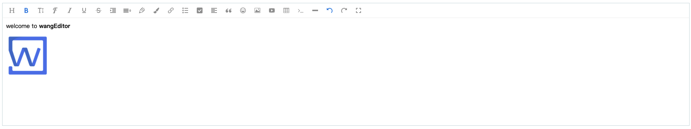

# wangEditor

<!-- Badge -->


<!-- PROJECT LOGO -->
<br />
<p align="center">
  <a href="http://www.wangeditor.com/">
    
  </a>

  <h3 align="center">wangEditor</h3>

  <p align="center">
    轻量级 web 富文本编辑器，配置方便，使用简单!
    <br />
    <a href="http://www.wangeditor.com"><strong>官网</strong></a>
    ·
    <a href="http://www.wangeditor.com/doc/"><strong>文档</strong></a>
    <br />
    <br />
    <a href="./README-en.md">English</a>
    ·
    <a href="http://www.wangeditor.com/doc/#demo">在线示例</a>
    ·
    <a href="https://github.com/wangeditor-team/wangEditor/issues/new?template=bug.md">提交 bug</a>
    ·
    <a href="https://github.com/wangeditor-team/wangEditor/issues/new?template=feature.md">建议增加新功能</a>
  </p>
</p>

<!-- ABOUT THE PROJECT -->
## 项目介绍

wangEditor 是一款使用 Typescript 开发的 Web 富文本编辑器， 轻量、简洁、易用、开源免费。

兼容常见的 PC 浏览器：Chrome，Firefox，Safar，Edge，QQ 浏览器，IE11。

不支持移动端。

当前是 `v4` 版本。想继续使用 `v3` 版本看[这里](http://www.wangeditor.com/doc/pages/01-%E5%BC%80%E5%A7%8B%E4%BD%BF%E7%94%A8/08-%E4%BD%BF%E7%94%A8V3%E7%89%88%E6%9C%AC.html)。



## 安装和使用

### NPM
```bash
npm i wangeditor --save
```
安装后几行代码即可创建一个编辑器：

```js
import E from "wangeditor";
const editor = new E("#div1");
editor.create();
```
### CDN
```html
<script type="text/javascript" src="https://unpkg.com/wangeditor/dist/wangEditor.min.js"></script>
<script type="text/javascript">
  const E = window.wangEditor
  const editor = new E('#div1')
  // 或者 const editor = new E(document.getElementById('div1'))
  editor.create()
</script>
```

<!-- CONTRIBUTING -->
## 贡献

贡献使得开源社区成为一个学习、激励和创造的好地方，非常感谢你所做的任何贡献。在贡献 `wangEditor` 之前，你需要阅读文档 [contribution](./docs/contribution.md)。

<!-- LICENSE -->
## 许可证

项目在 MIT 的许可证下发布， 查看更多 [MIT](https://en.wikipedia.org/wiki/MIT_license) 许可证信息。

<!-- CONTACT -->
## 交流

加入 QQ 群
- 164999061（人已满）
- 710646022（人已满）
- 901247714

提交 bug 或建议
- [github issues](https://github.com/wangeditor-team/wangeditor/issues) 提交问题

## 开发团队

有专业[开发团队](http://www.wangeditor.com/doc/#%E5%BC%80%E5%8F%91%E4%BA%BA%E5%91%98)维护，非个人单兵作战。

想加入 wangEditor 研发团队，可申请加入 QQ 群，然后私聊群主。

## 为我们加油

你的支持，将激励我们输出更多优质内容！


