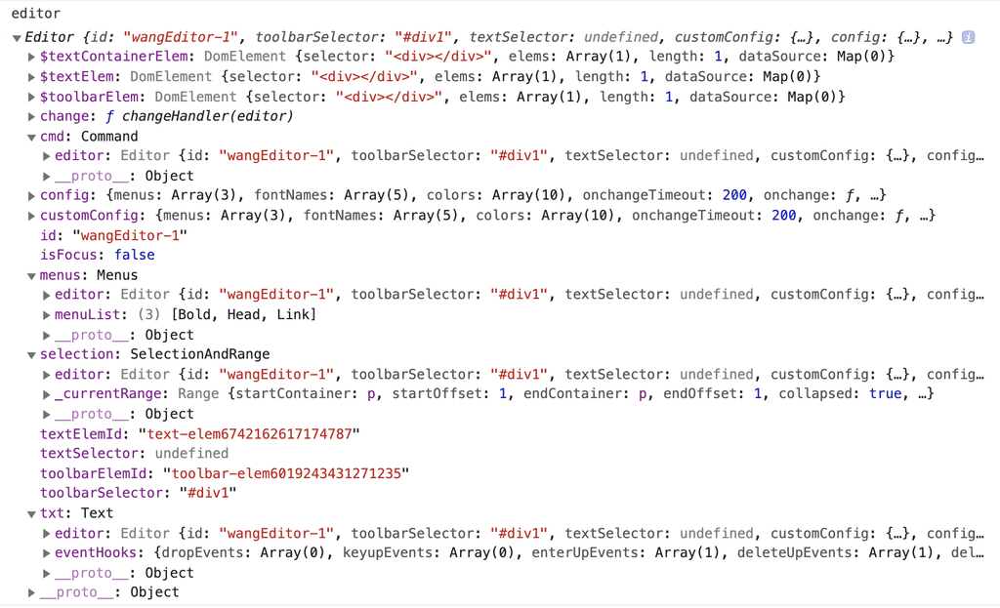

# 代码结构

源码介绍视频 https://www.bilibili.com/video/BV14p4y1v776

## 技术选型

- 语言：`typescript`
- 依赖框架和工具：无（编辑器作为第三方工具，应该控制自身的代码体积和依赖，让用户简单实用）
- 打包工具：`webpack`
- 测试工具 `jest` `cypress`

## 主要目录

- `.github/workflows` github actions（持续集成）的配置文件 
- `.vscode` vscode 编辑器配置（推荐大家使用 vscode）
- `attachment` 附件，和程序运行无关，但不可删除
- `build` webpack 配置
- `dist` 打包产出的目录。刚下载时没有该目录，本地运行 `npm run build` 即可生成
- `docs` 开发文档
- `examples` 本地测试用的 html 文件
- `server` 服务端，用于联调图片或文件上传的功能
- `src` 编辑器代码
- `test` 单元测试代码
- `cypress` E2E测试代码

## src 子目录

- `wangEditor.ts` 总入口
- `assets/` CSS 字体文件 图片
- `config/` 编辑器默认配置。配置项较多，所以按照分类拆分了多个文件。
- `editor/` 编辑器核心功能
    - `index.ts` 入口文件，产出编辑器的 class
    - `init-fns/` 初始化的功能
    - `upload/` 文件上传底层能力
    - `command.ts` 封装 `document.execCommand`
    - `selection.ts` 封装 `Selection` 和 `Range`
- `lib/` 用到的第三方 js lib （无法通过 npm 安装的）
- `menus/` 菜单栏和菜单
    - `index.ts` 菜单栏 class
    - `menu-constructors/` 生成单个菜单所用到的 class
    - `menu-list.ts` 汇总所有的菜单
    - 其他文件夹，具体的各个菜单，如 `bold` `link` 等
- `text/` 文本编辑区域
    - `index.ts` 入口文件，产出 class ，封装各个 API
    - `event-hooks/` 初始化 text 的各个事件钩子，如回车、粘贴、删除时应该做哪些特殊处理
    - `paste/` 处理粘贴事件
- `utils/` 工具
    - `const.ts` 常量
    - `dom-core.ts` 封装一个简单的 jquery ，进行 DOM 操作（引入 jquery 会导致体积过大，毕竟 jquery 里很多功能我们用不到）
    - `util.ts` 各个工具函数

## 编辑器实例数据结构

下载代码，然后本地运行起来，在 chrome 控制台输入 `editor` ，即可打印出数据结构。

