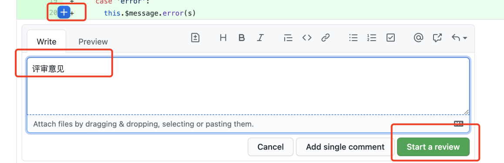
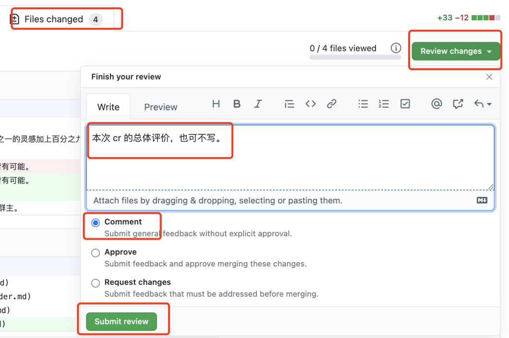
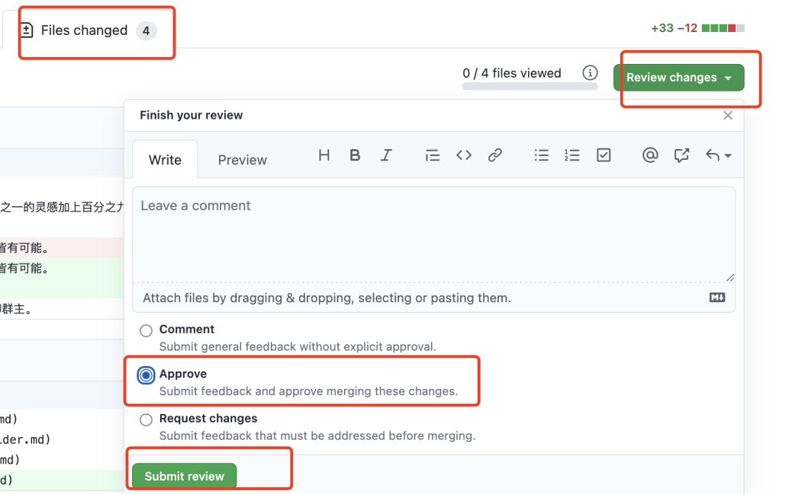

# 代码走查 合并代码

代码管理者，拿到提交的 PR 之后，做代码走查，最后合并代码到 dev 分支。

## 检查 PR

- 是否要往 `dev` 分支（或其他指定的分支）合并，而不是其他的分支
- commits 描述是否符合开发规范，如 `fix: xxx` `feat: xxx` 这种格式
- commits 是否需要合并？太零散了会影响 CHANGELOG.md 的阅读
- github actions 检查是否成功

## 代码走查

打开 PR 的 Files Changed ，详细做代码走查，重点关注：

- 代码逻辑是否合理
- 代码注释是否规范且合理
- 单元测试，用例是否完整
- 开发文档，使用文档，是否齐全
- 全局事件，是否会造成其他干扰？
- 定时器、自定义事件，是否有内存泄漏风险？

代码走查如果有问题，会在 Pull Request 上回复评论意见，并通知开发者。
开发者根据评论意见，继续修改，然后重新提交，重新代码走查。

## 反馈评审意见

第一，针对每一行，提交评审意见。

第二，待所有代码都审核完，统一提交本次 review 的意见，通知任务负责人。

第三，待任务负责人修改之后，重新审核。

## 通过审核

提交 Approve review ，通知任务负责人。

## 不用合并代码

代码审核通过之后，**不用**合并代码，通知负责人即可。

负责人等待所有 code review 结束之后，群里通知作者（群主）合并代码。
