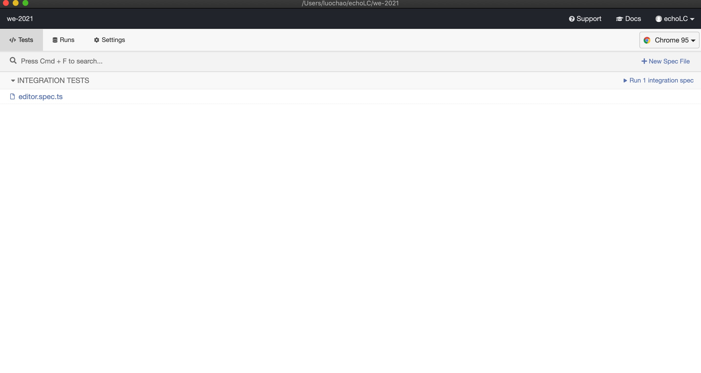
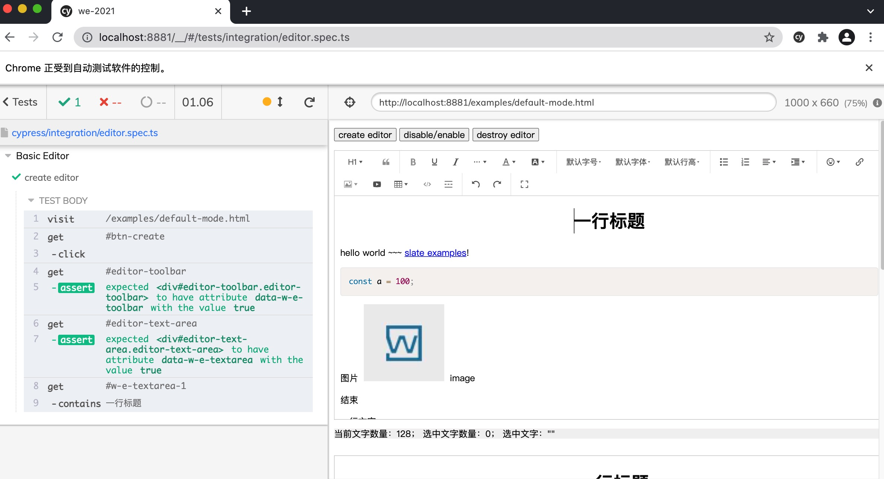

# 测试
目前我们的项目已经集成了基于 `Jest` 的单元测试和基于 `Cypress` 的 `E2E` 测试，下面简单介绍两种测试运行和编写的方式。

## 单元测试
单元测试是从最底层 `API` 的角度出发，保证编辑功能的质量。虽然我们是基于 `lerna` 的 monorepo 管理方式，为了方便组织，我们的所有测试还是都放在根目录下的 `tests/units` 下，每个 `packages` 下面的包都在 `tests/units` 下对应一个目录。所以如果需要新增 `test`，可以按照这个目录组织方式决定把新的 `test` 放在哪个目录。

### 运行单元测试
目前单元测试的运行已经集成在 CI 流程中，如果本地开发后，需要自动执行单元测试，运行如下 `scripts` 命令：
```bash
yarn run test
```
查看单元测试的覆盖率：
```bash
yarn run test-c
```

### 注意事项
- **因为各个模块依赖了 `core`，如果修改了 `core` 的代码，增加了 `API`，需要运行 `yarn build` 命令，使得各个模块能读到最新的代码**。

## E2E 测试
目前我们的项目 `E2E` 测试基于 [Cypress](https://docs.cypress.io/)，对于编辑器这种强依赖用户交互运作的产品，通过 `E2E` 保证编辑器交互更加稳定。

目前 `E2E` 测试只写了基本的创建基础编辑器的用例，保证打包后的代码能正常创建编辑器。

**`E2E` 测试用例目前都放在根目录下的 `cypress/integration` 目录下，如果需要增加新的测试用例，应该在此目录下创建文件。**

### 运行 E2E 测试
目前 E2E 测试的同样集成到了 CI 流程中，如果本地开发后，需要编写 E2E 测试，运行如下 `scripts` 命令：
```bash
yarn e2e:dev
```
该命令首先会启动 `packages/editor` 下面的 `example` 服务，然后再启动 Cypress 的命令， Cypress 会在本地调起 UI 界面：



然后你可以选择想要执行 E2E 的用例，然后执行后 Cypress 会调起浏览器，运行所有的测试用例，你可以直接在受控的浏览器直接调试你的测试：



如果不是为了开发新的测试用例，只是想要本地运行所有的 E2E 测试，则执行：
```bash
yarn e2e
```
Cypress 则会自己后台运行所有测试，并不会打开 UI 界面和浏览器。