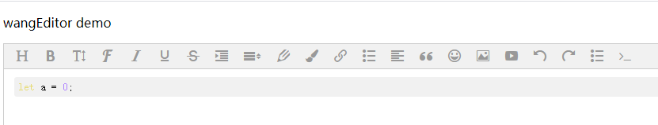
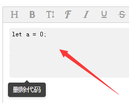

# Highlight Code
The code menu of wangEditor support to import `highlight js` plugin to implement highlight code function.And it provides a variety of styles. The highlight isn't built-in function, so you need to install plugin manually.

`highlight.js` website: [highlight](https://highlightjs.org/).

## Install Highlight

### NPM

```bash
npm install highlight.js -S
```

### CDN
```html
<script src="http://cdn.bootcss.com/highlight.js/8.0/highlight.min.js"></script>
```

## Mount Highlight
### 1. import highlight.js

```js
import hljs from 'highlight.js'
```
if you use CDN, `highlight.js` declare `hljs` variable under `window` object, you can use it directly.

### 2. import css

**By NPM:**

```js
import 'highlight.js/styles/monokai_sublime.css'
```
**By CDN:**

```html
<link href="http://cdn.bootcss.com/highlight.js/8.0/styles/monokai-sublime.min.css" rel="stylesheet">
```
If you finished all steps above, it will have highlight styles when you use code menu to insert code.The result as follows:



## Show Content
You need to import `highlight.js` style when you read content from server to show in page.

The way that install `highlight.js` the same as introduction above.

If you want to leran more about `highlight.js`, you can reference offical website.

## Insert Code Options
### 1.languageType
The `languageType` option is select box options when you insert code. We set many commonly used programming languages. If you want to set more, you can custom it by `languageType`:

```js
editor.config.languageType = [
    'Bash',
    'C',
    'C#',
    'C++',
    'CSS',
    'Java',
    'JavaScript',
    'JSON',
    'TypeScript',
    'Plain text',
    'Html',
    'XML',
    'SQL',
    'Go',
    'Kotlin',
    'Lua',
    'Markdown',
    'PHP',
    'Python',
    'Shell Session',
    'Ruby',
]
```
### 2.languageTab
You can edit code in grey area after inserting code. We made tab key behavior to be consistent for eliminating different behavior between browsers. You can use `languageTab` option to set "typing the characters" of tab key. The default value is four full-horn spaces.

```js
editor.config.languageTab = '    '
```

The `languageTab` option decide to tab behavior within `pre` area.




 